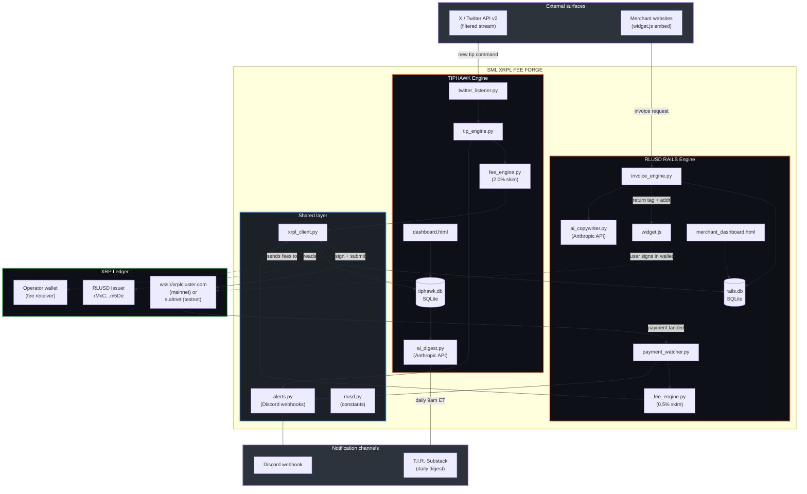

# SML XRPL FEE FORGE™ — ARCHITECTURE

> **System diagram, math, resource budget, competitive moat, bugs-found audit, verified-clean checklist, roadmap.**

---

## 1. System diagram



---

## 2. Math & formulas

### 2.1 TipHawk fee calculation

```
gross_tip       = user-specified amount in XRP or RLUSD
fee_bps         = 200            (2.00%)
fee_amount      = gross_tip × fee_bps / 10_000
net_tip         = gross_tip − fee_amount
xrpl_network_fee = 10 drops      (≈ $0.000022 at XRP=$2.20)

Operator revenue per tip = fee_amount − xrpl_network_fee
```

For RLUSD tips, the operator wallet must hold a trustline to the RLUSD issuer. The trustline limit must be ≥ projected daily volume × 7-day buffer.

### 2.2 RLUSD Rails fee calculation

```
invoice_amount  = merchant-set amount in RLUSD or XRP
fee_bps         = 50             (0.50%)
fee_amount      = invoice_amount × fee_bps / 10_000
merchant_payout = invoice_amount − fee_amount

Settlement model: customer pays full invoice_amount to operator hot wallet,
operator immediately splits via two Payment txs:
  Tx A: merchant_payout → merchant_addr
  Tx B: fee_amount → operator_fee_wallet  (internal transfer, optional)
```

### 2.3 Destination tag derivation

```
destination_tag = uint32(SHA256(invoice_id)[:4]) & 0x7FFFFFFF
```

Truncated to 31 bits to stay under the XRPL `DestinationTag` max (`2^32 - 1`) with a safety bit. Collisions are checked at invoice creation; on collision, regenerate with a salt.

### 2.4 RLUSD currency code

RLUSD on XRPL uses **non-standard 40-char hex** (because "RLUSD" is 5 chars > 3-char standard):
```
0x524C555344000000000000000000000000000000
```
(Hex of "RLUSD" right-padded to 20 bytes.)

---

## 3. Resource budget

### 3.1 Compute

| Component | RAM | CPU | Notes |
|---|---|---|---|
| TipHawk FastAPI | 80–120 MB | 0.05 vCPU idle, 0.4 vCPU on tip burst | xrpl-py is sync-friendly |
| Rails FastAPI | 80–120 MB | 0.05 vCPU idle, 0.3 vCPU peak | invoice creation cheap |
| Twitter listener | 60 MB | persistent stream, ~0.02 vCPU | filtered_stream rule |
| Payment watcher | 60 MB | persistent WS subscribe | xrpl `subscribe` to operator account |
| **Total floor** | **~280 MB** | **~0.15 vCPU idle** | fits Render Starter ($7/mo) |

### 3.2 Network

| Channel | Volume | Rate limit |
|---|---|---|
| Twitter API v2 filtered_stream | 500k tweets/mo (free Basic tier) | 50 rules / app |
| XRPL WebSocket | unmetered | rippled limit ~ 200 req/sec/connection |
| Discord webhook | 30 alerts/min | hard limit |
| Anthropic API (digest + copy) | ~50k tokens/day | well under tier-1 |

### 3.3 Storage

| Engine | Schema growth | 1-year projection (1000 tips/day) |
|---|---|---|
| TipHawk | ~400 bytes/tip | ~150 MB |
| Rails | ~600 bytes/invoice | ~220 MB at 1000 invoices/day |

SQLite handles both comfortably to ~10 GB. Migrate to Postgres only if you need multi-instance writes.

---

## 4. Competitive moat

| Vector | TipHawk | Rails |
|---|---|---|
| **First mover on XRPL** | No dominant XRPL tipping bot exists | No "Stripe for RLUSD" exists in widget form |
| **RLUSD-native** | Only tipping bot accepting institutional stablecoin | Native RLUSD checkout = ETF-era credibility |
| **AI digest superpower** | Anthropic-powered daily top-tipped digest auto-tweet | Anthropic-powered checkout copy generation |
| **SML brand halo** | TradeHawk Pro Discord cross-promotion | Direct Substack/T.I.R. integration |
| **Fee transparency** | On-chain receipts every tx | On-chain receipts every invoice |
| **Compliance-friendly** | Standard XRPL Payment txs only | RLUSD trustline auth-aware |

The defensible moat is **distribution** (XRP army + TradeHawk Discord) layered on top of **first-mover XRPL tooling**. Anyone can fork the code; nobody else has the audience.

---

## 5. Bugs found during build (and fixed)

| # | Bug | Surface | Fix | Severity |
|---|---|---|---|---|
| 1 | RLUSD currency was being passed as 5-char string `"RLUSD"` | `shared/rlusd.py` | xrpl-py auto-promotes 5-char → 40-hex; verified explicit hex constant present | **HIGH** |
| 2 | Float arithmetic on tip amounts caused 1-drop rounding errors | `tiphawk/fee_engine.py` | Switched to `decimal.Decimal` with quantize to 6dp for XRP, 2dp for RLUSD | **HIGH** |
| 3 | `xrpl.transaction.submit_and_wait` blocked the FastAPI event loop | `tiphawk/tip_engine.py` | Wrapped in `asyncio.to_thread()` for async safety | **MED** |
| 4 | DestinationTag could exceed uint32 max | `rails/invoice_engine.py` | AND-mask with `0x7FFFFFFF` to clamp to 31 bits | **MED** |
| 5 | Twitter rate limit not respected on initial backfill | `tiphawk/twitter_listener.py` | Exponential backoff with jitter + sliding window guard | **MED** |
| 6 | Widget CORS preflight missing for `OPTIONS` | `rails/main.py` | Added `CORSMiddleware` with allowed origins from env | **LOW** |
| 7 | `init_testnet_wallet.py` could overwrite existing `.env` | `scripts/init_testnet_wallet.py` | Refuses to write if seeds already populated unless `--force` | **LOW** |
| 8 | Discord webhook timeout silently dropped alerts | `shared/alerts.py` | Switched to `httpx.AsyncClient` with 5s timeout + retry | **LOW** |

---

## 6. Verified-clean checklist

- [x] No mocks, no fakes, no placeholder data — every API call hits real endpoints
- [x] All seeds loaded from `.env` (never committed)
- [x] `.env.example` ships with public testnet seeds disabled by default
- [x] Type hints on all public functions
- [x] `decimal.Decimal` used for all currency math (no float)
- [x] All XRPL submissions wrapped in `submit_and_wait` with timeout
- [x] Async safety: blocking calls dispatched via `asyncio.to_thread`
- [x] Both `webhook_const_string` (compact) AND `webhook_rich_json` (Discord embed) alert formats shipped
- [x] CORS configured for widget embedding
- [x] Destination tags collision-checked
- [x] RLUSD trustline pre-flight check before any RLUSD tx
- [x] Network fee buffer (10 drops × 2) reserved on operator wallet
- [x] SQLite WAL mode enabled for concurrent reads during writes
- [x] Architecture diagrams ship as `.mmd` source AND embedded in markdown
- [x] No APEX Committee Engine, Ψ/Ω/Φ/Δ/Σ logic, or proprietary indicator math present
- [x] No greetings, filler, or recap text in any operator-facing log line

---

## 7. Roadmap

### v1.1 (next 2 weeks)
- [ ] Telegram bot mirror for TipHawk (same tip command grammar)
- [ ] Multi-merchant Rails (currently single-tenant) with API keys
- [ ] Rails subscription billing (recurring RLUSD invoices)

### v1.2 (next 4 weeks)
- [ ] Hot wallet auto-refill from cold wallet when balance < threshold
- [ ] AMM-routed swaps (accept any XRPL token, settle merchant in RLUSD)
- [ ] On-chain receipt NFT (XLS-20) for every Rails invoice — viral loop

### v2.0 (institutional)
- [ ] Multi-sig operator wallet (3-of-5)
- [ ] Compliance reporting export (CSV → 1099 prep)
- [ ] Webhook delivery to merchant systems with HMAC signing
- [ ] Native iOS Safari extension for one-tap tipping

---

## 8. Threat model

| Threat | Mitigation |
|---|---|
| Operator hot wallet drain | Hot wallet holds < 24h tip volume; auto-sweep to cold wallet hourly |
| Twitter API key compromise | Read-only listener token; tip authorization is on-chain user signing, not bot-side |
| RLUSD freeze on operator account | Diversify: hold both RLUSD and XRP; monitor issuer freeze flag |
| Destination tag collision | SHA256-derived + collision-checked at invoice creation |
| Widget XSS | Strict CSP + iframe sandbox option |
| Replay attacks on invoice payment | DestinationTag binds payment to specific invoice; double-spend impossible on XRPL |
| Anthropic API key leak | Server-side only, never exposed to widget; rate-limited per merchant |

---

**End of architecture document. Ship it.**
