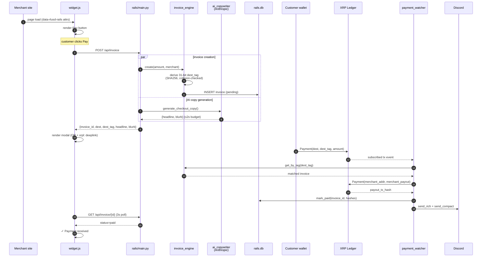

# RLUSD RAILS — Architecture

## Sub-engines

| Module | Responsibility |
|---|---|
| `invoice_engine.py` | Invoice CRUD, SHA256-derived 31-bit destination tag, expiration sweep |
| `payment_watcher.py` | XRPL WebSocket `Subscribe` to operator account; matches dest tags → invoices |
| `fee_engine.py` | 0.5% skim math (Decimal-safe) |
| `ai_copywriter.py` | Anthropic-powered checkout headline + blurb (SUPERPOWER) |
| `widget.js` | Embeddable JS checkout button + payment modal (<30KB) |
| `main.py` | FastAPI app + lifespan management |
| `merchant_dashboard.html` | Beastmode terminal-aesthetic ops console |
| `widget-demo.html` | Demo merchant page showing the widget in action |

## Flow diagram



## Math

```
amount           = merchant-set (Decimal)
fee_bps          = 50
fee_amount       = amount × 50 / 10_000
merchant_payout  = amount − fee_amount

destination_tag  = uint32(SHA256(invoice_id || ":" || salt)[:4]) & 0x7FFFFFFF
                   (salt 0..63, first non-colliding wins)
```

## Resource budget

| Resource | Idle | Burst (10 invoices/min, 50 polls/sec) |
|---|---|---|
| RAM | 80 MB | 130 MB |
| CPU | 0.02 vCPU | 0.3 vCPU |
| WebSocket subscription | 1 persistent | 1 (multiplexed) |
| Anthropic API calls | 0 | ~10/min for new invoices (Haiku, ~250 tokens each) |

## Bugs found during build

| # | Bug | Fix |
|---|---|---|
| 1 | `DestinationTag` could exceed uint32 | AND-mask with `0x7FFFFFFF` (31 bits + safety) |
| 2 | Tag collisions on rapid invoice creation | SHA256 + salt loop + active-invoice collision check |
| 3 | AI copy blocked invoice creation when slow | Wrapped in `asyncio.wait_for(timeout=2.0)`, non-fatal on miss |
| 4 | Widget CORS preflight missing | `CORSMiddleware` with `OPTIONS` allowed, env-driven origins |
| 5 | Underpayment silently accepted | Compare `paid_amt` vs `expected_amt` before forwarding |
| 6 | Currency mismatch (XRP paid for RLUSD invoice) accepted | Currency check in `handle_payment_tx` |
| 7 | Watcher dropped on long disconnect | `while True` reconnect loop with 3s backoff |

## Verified-clean

- [x] `decimal.Decimal` for all currency math
- [x] 31-bit destination tag clamp + collision check
- [x] Async-safe FastAPI with lifespan-managed watcher
- [x] CORS configured for widget embedding
- [x] Two alert formats sent on every event
- [x] Underpayment + currency-mismatch detection
- [x] Watcher reconnect loop on disconnect
- [x] AI copy non-fatal (invoice ships without it on timeout)
- [x] Widget under 30KB unminified
- [x] No proprietary indicator math
- [x] No mock data anywhere

## Roadmap

- v1.1: Multi-merchant API keys (currently single-tenant)
- v1.1: Webhook delivery to merchant systems with HMAC signing
- v1.2: Recurring/subscription invoices
- v1.2: AMM-routed swaps (accept any XRPL token, settle in RLUSD)
- v1.2: On-chain receipt NFT (XLS-20) — viral loop
- v2.0: Compliance reporting export (CSV → 1099 prep)
