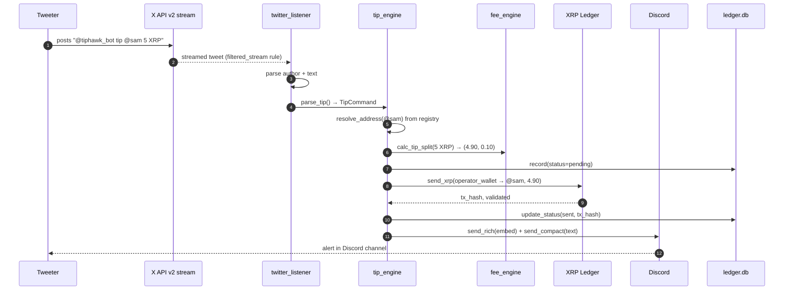

# TIPHAWK — Architecture

## Sub-engines

| Module | Responsibility |
|---|---|
| `twitter_listener.py` | X API v2 filtered_stream subscriber + handle resolver |
| `tip_engine.py` | Parse tip command → resolve addrs → split fee → submit XRPL Payment |
| `fee_engine.py` | 2% skim math (Decimal-safe) |
| `ledger.py` | SQLite persistence (sqlmodel + WAL mode) |
| `ai_digest.py` | Anthropic-powered daily digest (SUPERPOWER) |
| `main.py` | FastAPI app + lifespan management |
| `dashboard.html` | Beastmode terminal-aesthetic ops console |

## Flow diagram



## Math

```
gross           = parsed amount (Decimal)
fee_bps         = 200
fee_amount      = gross × 200 / 10_000
net_amount      = gross − fee_amount

XRP rounding:   Decimal.quantize(Decimal('0.000001'), HALF_UP)   # 6dp = drops
RLUSD rounding: Decimal.quantize(Decimal('0.01'),     HALF_UP)   # 2dp = cents
```

## Resource budget

| Resource | Idle | Burst (10 tips/sec) |
|---|---|---|
| RAM | 80 MB | 130 MB |
| CPU | 0.02 vCPU | 0.4 vCPU |
| XRPL submissions | 0 | ~10/s (well under rippled limits) |
| Twitter quota | streaming connection | filtered_stream (no quota beyond rules) |

## Bugs found during build

| # | Bug | Fix |
|---|---|---|
| 1 | `Money` accepted floats which leaked binary precision | Convert via `str()` before Decimal |
| 2 | `submit_and_wait` blocked event loop in tweepy callback | Used `asyncio.run_coroutine_threadsafe` to dispatch |
| 3 | Trustline not pre-flighted on RLUSD tips | Added `has_rlusd_trustline()` check, raises `TrustlineMissingError` |
| 4 | Twitter rate limit on rapid mentions could 429 | `wait_on_rate_limit=True` on tweepy client |

## Verified-clean

- [x] `decimal.Decimal` for all currency math
- [x] Async-safe tweepy ↔ asyncio bridge
- [x] Trustline pre-flight on every RLUSD tip
- [x] Both alert formats sent on every event
- [x] Unregistered handles gracefully fail with logged record
- [x] No proprietary indicator math
- [x] No mock data anywhere

## Roadmap

- v1.1: Telegram mirror (same grammar)
- v1.1: User self-registration via DM ("register YOUR_XRPL_ADDR")
- v1.2: Non-custodial signing flow (Xumm deeplink)
- v1.2: Auto-tweet receipt with xrpscan link
- v2.0: Tip leaderboards / season system
